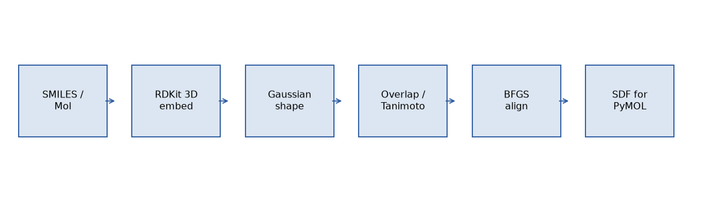
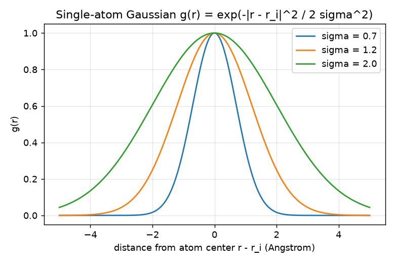
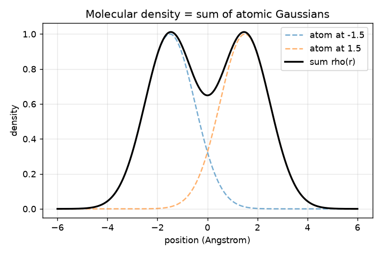
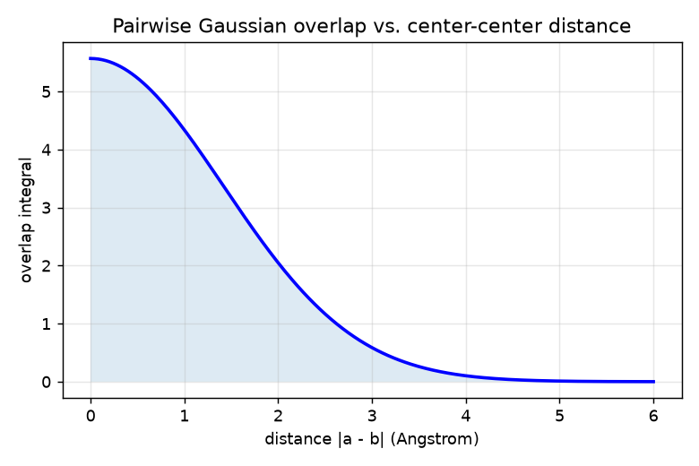

# Gaussian Molecular Shape: Representation, Comparison, and Alignment

A hands-on tutorial for the `core/gaussian_shape.py` module. It explains **what**
the algorithm computes, **why** it works, and **how** to use it, with formulas and
figures.

---

## 1. Motivation: why represent shape with Gaussians?

A natural way to compare two 3D molecules is **RMSD** (root-mean-square deviation
of atom positions). But RMSD has real limitations:

- It needs a one-to-one **atom correspondence** (same atoms, same count, same order).
- It is sensitive to tiny perturbations and says nothing about the **occupied volume**.
- It cannot compare two *different* molecules that happen to have a similar shape.

The **Gaussian shape** approach instead asks a different question:

> *"Do these two molecules occupy space in a similar way?"*

This is the foundation of shape-based virtual screening in drug discovery
(e.g. OpenEye's ROCS). The whole pipeline looks like this:



---

## 2. The representation

### 2.1 One atom = one Gaussian

Each atom `i` at position `r_i` is modeled as an isotropic 3D Gaussian:

$$
g_i(\mathbf{r}) = \exp\!\left(-\frac{\lVert \mathbf{r} - \mathbf{r}_i \rVert^2}{2\sigma_i^2}\right)
$$

The width `sigma_i` controls how "fat" the atom is. In the code it is derived
from the atom's **van der Waals radius**:

$$
\sigma_i = \texttt{radius\_scale} \times R^{\text{vdW}}_i
$$



*A larger `sigma` produces a wider, softer atom.*

### 2.2 The whole molecule = a sum of Gaussians

The molecular shape density is simply the sum over all atoms:

$$
\rho(\mathbf{r}) = \sum_{i=1}^{N} g_i(\mathbf{r})
$$



*Two atomic Gaussians (dashed) add up into a smooth molecular density (solid).*

In code this is `GaussianShape.density(points)`.

---

## 3. Measuring similarity

### 3.1 The overlap integral (the key trick)

The similarity of two shapes is the **overlap** of their densities,
`integral of rho_A(r) * rho_B(r) dr`. Because both are sums of Gaussians, and the
product/integral of two Gaussians is analytic, the whole thing has a
**closed-form solution** — no numerical grid needed.

For a single pair of Gaussians centered at `a` and `b`:

$$
S_{ab} = \int g_a(\mathbf{r})\, g_b(\mathbf{r})\, d\mathbf{r}
= \left(\frac{2\pi\,\sigma_a^2\,\sigma_b^2}{\sigma_a^2+\sigma_b^2}\right)^{3/2}
\exp\!\left(-\frac{\lVert \mathbf{a}-\mathbf{b}\rVert^2}{2(\sigma_a^2+\sigma_b^2)}\right)
$$

The total overlap between molecules A and B sums over **all atom pairs**:

$$
S_{AB} = \sum_{i \in A}\sum_{j \in B} S_{ij}
$$



*Overlap decays like a Gaussian in the center-center distance: atoms far apart
contribute almost nothing, atoms sitting on top of each other contribute most.*

In code: `shape_a.overlap(shape_b)`, fully vectorized with NumPy.

### 3.2 Self-overlap and the Tanimoto coefficient

The **self-overlap** `S_AA = overlap(A, A)` measures a molecule's "shape mass".
The shape similarity is reported as a **Tanimoto-like coefficient**, normalized to
`[0, 1]`:

$$
T = \frac{S_{AB}}{S_{AA} + S_{BB} - S_{AB}}
$$

- `T = 1` : the two shapes overlap perfectly.
- `T = 0` : no overlap at all.

In code: `shape_a.tanimoto(shape_b)`.

---

## 4. Alignment: comparing shapes in a common frame

Tanimoto depends on the **relative pose** of the two molecules. If B is sitting
far away, `T ~ 0` even for identical shapes. So before comparing we must find the
rigid-body transform (rotation `R` + translation `t`) of the *mobile* molecule
that **maximizes** the overlap with the *reference*.

### 4.1 A useful simplification

Under a rigid motion of the mobile molecule, its self-overlap `S_AA` and the
reference `S_BB` are **constant**. Since

$$
T = \frac{S_{AB}}{C - S_{AB}}, \qquad C = S_{AA} + S_{BB} = \text{const},
$$

and `dT/dS_AB = C / (C - S_AB)^2 > 0`, maximizing `T` is **equivalent** to
maximizing the raw overlap `S_AB`. This keeps the gradient simple.

### 4.2 BFGS with an analytical gradient

We optimize 6 parameters: 3 Euler angles + 3 translations,
`p = [rz, ry, rx, tx, ty, tz]`. The mobile atoms are transformed as
`a' = R(angles) a + t`, and we minimize `-S_AB(p)`.

Because the overlap is smooth, we can hand BFGS an **exact gradient**. With
`d_ij = a'_i - b_j` and `s_ij^2 = sigma_i^2 + sigma_j^2`:

$$
\frac{\partial S}{\partial \mathbf{d}_{ij}} = S_{ij}\left(-\frac{\mathbf{d}_{ij}}{s_{ij}^2}\right),
\qquad
\mathbf{G}_i = \sum_j \frac{\partial S}{\partial \mathbf{d}_{ij}}
$$

$$
\frac{\partial S}{\partial \mathbf{t}} = \sum_i \mathbf{G}_i,
\qquad
\frac{\partial S}{\partial \theta_k} = \sum_i \mathbf{G}_i \cdot \left(\frac{\partial R}{\partial \theta_k}\mathbf{a}_i\right)
$$

The overlap surface is **non-convex**, so the optimizer is restarted from several
random rotations (`n_starts`) and the best result is kept.

In code: `align_shapes_bfgs(mobile, reference, n_starts, seed)`. A simpler,
rotation-only Powell baseline is also available as `align_shapes(...)`.

### 4.3 The transform maps the original coordinates

The optimizer works in a centered frame, but the returned transform is composed
back onto the **original** mobile coordinates so you can apply it directly:

$$
\mathbf{r}' = R(\mathbf{r} - \mathbf{c}_{mob}) + (\mathbf{t}_{opt} + \mathbf{c}_{ref})
            = R\,\mathbf{r} + \underbrace{(-R\,\mathbf{c}_{mob} + \mathbf{t}_{opt} + \mathbf{c}_{ref})}_{\mathbf{t}}
$$

`apply_transform_to_mol(mol, R, t)` rewrites an RDKit conformer in place so the
real 3D structure moves into the aligned frame.

---

## 5. Inputs, outputs, and parameters

### `GaussianShape`

| Item | Meaning |
|---|---|
| `centers` (N,3) | atom coordinates in Angstrom |
| `sigmas` (N,) | Gaussian width per atom in Angstrom |
| `elements` | element symbols (bookkeeping / plotting) |

Constructors:

- `GaussianShape.from_coordinates(coords, elements, radius_scale=0.8)`
- `GaussianShape.from_rdkit_mol(mol, conf_id=-1, radius_scale=0.8, include_hydrogens=True)`

| Parameter | Meaning | Typical |
|---|---|---|
| `radius_scale` | multiplies vdW radius to set `sigma`. Smaller = tighter atoms, more sensitive to detail; larger = softer, more tolerant. | 0.7 - 0.9 |
| `include_hydrogens` | include H atoms or compare heavy-atom shape only | `True` |
| `conf_id` | which RDKit conformer to use | `-1` (default) |

Methods:

- `density(points) -> (M,)` : evaluate `rho(r)` (for visualization).
- `overlap(other) -> float` : analytical `S_AB`.
- `self_overlap() -> float` : `S_AA`.
- `tanimoto(other) -> float` : similarity in `[0, 1]`.
- `centroid()`, `translated(v)`, `transformed(R, t)` : geometry helpers.

### `align_shapes_bfgs(mobile, reference, n_starts=8, seed=0)`

| Parameter | Meaning |
|---|---|
| `mobile` | shape to be moved |
| `reference` | fixed target shape |
| `n_starts` | number of random rotational restarts (more = more robust, slower) |
| `seed` | RNG seed for reproducible restarts |

Returns an **`AlignmentResult`**:

| Field | Meaning |
|---|---|
| `aligned` | the transformed `GaussianShape` |
| `tanimoto` | similarity after alignment |
| `rotation` (3,3) | `R` for the original mobile coordinates |
| `translation` (3,) | `t` for the original mobile coordinates |
| `.matrix` | 4x4 homogeneous transform |
| `.apply_to_coords(coords)` | apply the transform to any `(N,3)` array |

### `apply_transform_to_mol(mol, rotation, translation, conf_id=-1)`

Rewrites the RDKit conformer positions in place; returns the same `mol`.

---

## 6. The essential code

The whole module is built around **one Gaussian overlap kernel** that reappears in
three places: density evaluation, similarity scoring, and the alignment objective.
Here are the minimal pieces from `core/gaussian_shape.py`.

### 6.1 Representation

An atom becomes a Gaussian whose width comes from its van der Waals radius:

```python
radii = np.array([VDW_RADII.get(e, DEFAULT_RADIUS) for e in elements])
sigmas = radius_scale * radii            # sigma_i = radius_scale * R_vdw
return cls(centers=coords, sigmas=sigmas, elements=elements)
```

The molecular density `rho(r) = sum_i exp(-|r - r_i|^2 / 2 sigma_i^2)` broadcasts
every query point against every atom:

```python
diff = points[:, None, :] - self.centers[None, :, :]   # (M, N, 3)
sq_dist = np.einsum("mnk,mnk->mn", diff, diff)          # (M, N)
gauss = np.exp(-sq_dist / (2.0 * self.sigmas[None, :] ** 2))
return gauss.sum(axis=1)                                # sum over atoms -> (M,)
```

The `[:, None, :]` / `[None, :, :]` trick forms all pair combinations at once, so
everything stays vectorized.

### 6.2 Similarity

The overlap integral of two Gaussians is **analytic**, so no grid is needed. Total
overlap is a double sum over atom pairs:

```python
diff = self.centers[:, None, :] - other.centers[None, :, :]  # (Na, Nb, 3)
sq_dist = np.einsum("abk,abk->ab", diff, diff)               # (Na, Nb)

sa2 = self.sigmas[:, None] ** 2     # (Na, 1)
sb2 = other.sigmas[None, :] ** 2    # (1, Nb)
sum_s2 = sa2 + sb2                  # (Na, Nb)

prefactor = (2.0 * np.pi * sa2 * sb2 / sum_s2) ** 1.5
pair_overlap = prefactor * np.exp(-sq_dist / (2.0 * sum_s2))
return float(pair_overlap.sum())    # S_AB
```

Similarity is the normalized Tanimoto:

```python
s_ab = self.overlap(other)
s_aa = self.self_overlap()          # = overlap(A, A)
s_bb = other.self_overlap()
return float(s_ab / (s_aa + s_bb - s_ab))   # T in [0, 1]
```

### 6.3 Alignment

Alignment maximizes `S_AB` over a rigid transform. One function returns **both** the
overlap and its exact gradient, so BFGS converges fast:

```python
a_prime = mobile_centers @ rot.T + translation   # a' = R a + t
diff = a_prime[:, None, :] - ref_centers[None, :, :]
d2 = np.einsum("abk,abk->ab", diff, diff)
# ... same overlap kernel as 6.2 ...
kernel = prefactor * np.exp(-d2 / (2.0 * s2))
overlap = float(kernel.sum())

# gradient: dS/d(diff_ij) = kernel_ij * (-diff_ij / s2_ij)
coeff = (-kernel / s2)[:, :, None]
grad_per_atom = np.einsum("abk->ak", coeff * diff)   # G_i, one 3-vec per atom

grad_t = grad_per_atom.sum(axis=0)                   # dS/dt = sum_i G_i
grad_angles = np.array([                             # dS/dtheta = sum_i G_i . (dR/dtheta) a_i
    np.sum(grad_per_atom * (mobile_centers @ d_rz.T)),
    np.sum(grad_per_atom * (mobile_centers @ d_ry.T)),
    np.sum(grad_per_atom * (mobile_centers @ d_rx.T)),
])
```

Note the `kernel` here is the same overlap formula as in 6.2 — scoring and alignment
share it. The optimizer minimizes `-overlap` over `[rz, ry, rx, tx, ty, tz]` with
random restarts, then composes the transform back onto the original coordinates.

---

## 7. Worked example

```python
from rdkit import Chem
from rdkit.Chem import AllChem
from core.gaussian_shape import GaussianShape, align_shapes_bfgs, apply_transform_to_mol

# 1) Build a 3D molecule.
mol = Chem.AddHs(Chem.MolFromSmiles("c1ccccc1"))
AllChem.EmbedMolecule(mol, AllChem.ETKDGv3())
AllChem.MMFFOptimizeMolecule(mol)

# 2) Build its Gaussian shape.
shape = GaussianShape.from_rdkit_mol(mol, radius_scale=0.8)
print("self-overlap:", shape.self_overlap())

# 3) Compare two shapes (after aligning them).
result = align_shapes_bfgs(mobile_shape, reference_shape, n_starts=8)
print("Tanimoto:", result.tanimoto)

# 4) Move the real molecule into the aligned frame and export.
apply_transform_to_mol(mol, result.rotation, result.translation)
```

### Runnable demos

- `python examples/example_shape.py` — pairwise similarity matrix (aligned),
  a conformer-alignment demo, and 2D density figures.
- `python examples/example_align_sdf.py` — displaces a molecule ~54 A away with a
  random rotation, realigns it, and writes SDF files for PyMOL.

Example demo figures:

| Single-shape density | Two shapes overlaid |
|---|---|
|  |  |

---

## 8. Visualizing in PyMOL

`examples/example_align_sdf.py` writes three files to `examples/output/`:

```
load examples/output/ref.sdf            # reference at origin
load examples/output/mobile_start.sdf   # displaced ~54 A away
load examples/output/mobile_aligned.sdf # snapped back onto the reference
```

You should see `mobile_start` far off in space and `mobile_aligned` sitting
directly on top of `ref`.

---

## 9. Things to explore

1. **Change `radius_scale`** (0.5 vs 1.0): how does the Tanimoto matrix change?
2. **Heavy-atom-only** shapes (`include_hydrogens=False`): faster, and often the
   more chemically meaningful comparison.
3. **`n_starts`** in the aligner: how few restarts still recover a good alignment?
4. **Different conformers** of the same molecule: the best Tanimoto is now < 1;
   this is a more realistic shape-matching test than a rigid displacement.
5. **Second-order overlap** (inclusion-exclusion of triple Gaussian products):
   the first-order pairwise sum used here slightly over-counts overlap in dense
   regions. Try correcting it.

---

## 10. References

- Grant, J. A.; Pickett, S. D. *A Gaussian Description of Molecular Shape.*
  J. Phys. Chem. 1995, 99, 3503-3510.
- Grant, J. A.; Gallardo, M. A.; Pickett, S. D. *A fast method of molecular shape
  comparison.* J. Comput. Chem. 1996, 17, 1653-1666. (ROCS.)
- Bondi, A. *van der Waals Volumes and Radii.* J. Phys. Chem. 1964, 68, 441-451.
