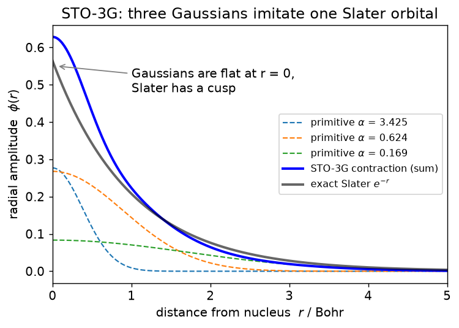
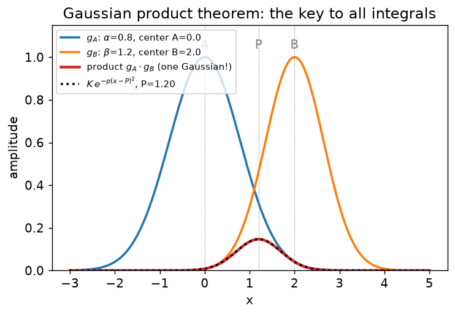
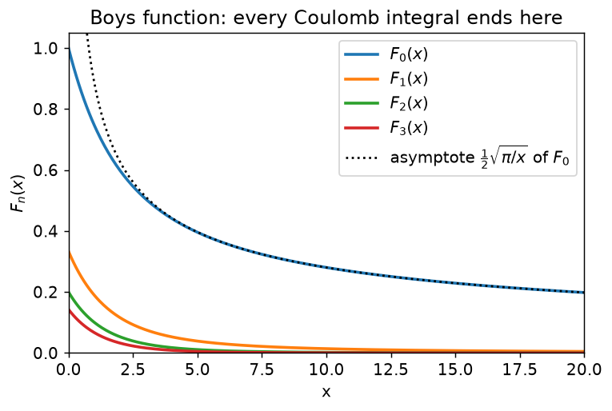
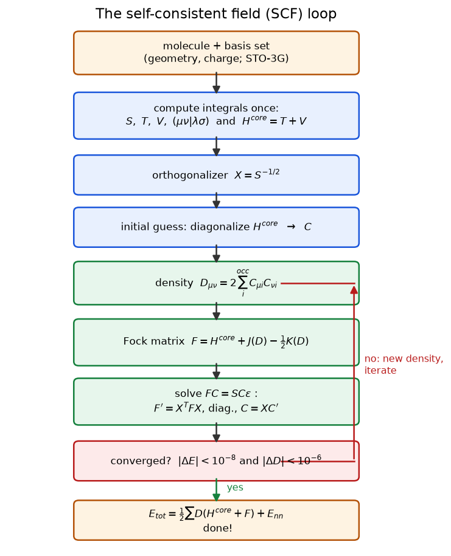
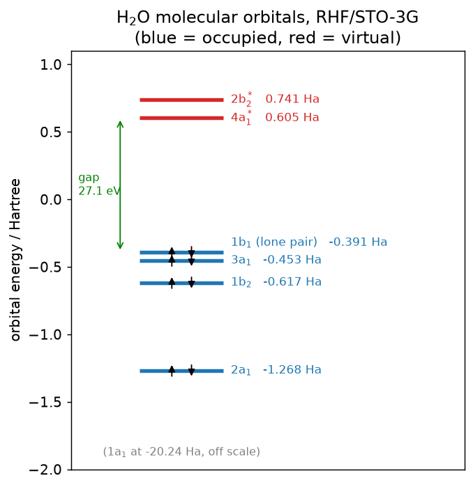
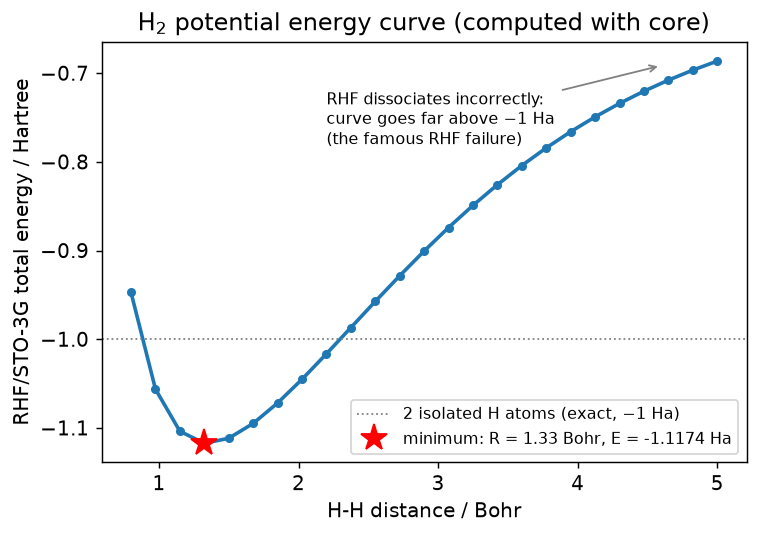

# 动手教程：用 Python 从零实现 Hartree–Fock 方法

*本文是 `core` 教学程序（纯 Python + numpy + scipy + RDKit）的配套讲义。*

本教程逐步讲解 Hartree–Fock（HF）计算的**每一个环节**，并展示每条公式如何
对应到一小段 Python 代码。所有代码片段均取自
[`core/`](../core) 中的真实程序（个别做了轻微精简），你随时可以从
文字跳回可运行的源码。

**目录**

1. [我们要解决什么问题？](#1-我们要解决什么问题)
2. [Hartree–Fock 近似](#2-hartreefock-近似)
3. [基组：STO-3G](#3-基组sto-3g)
4. [分子积分](#4-分子积分)
5. [SCF 自洽场流程](#5-scf-自洽场流程)
6. [解读计算结果](#6-解读计算结果)
7. [案例研究：拉断 H₂](#7-案例研究拉断-h)
8. [课后练习](#8-课后练习)
9. [参考文献](#9-参考文献)

---

## 1. 我们要解决什么问题？

化学的本质，是电子在原子核周围运动的量子力学。对一个含 $N$ 个电子、
$M$ 个原子核的分子，我们要求解定态薛定谔方程

$$
\hat{H}\,\Psi = E\,\Psi .
$$

两个标准的简化把它变成可计算的问题：

**(a) Born–Oppenheimer 近似。** 原子核比电子重几千倍，因此把核固定在
位置 $\mathbf{R}_A$ 上，只解电子部分。电子哈密顿量
（**原子单位制**：$\hbar = m_e = e = 4\pi\varepsilon_0 = 1$；
能量单位 Hartree，长度单位 Bohr）为

$$
\hat{H}_{el}
= \underbrace{-\sum_{i=1}^{N} \tfrac{1}{2}\nabla_i^2}_{\text{动能}}
\; \underbrace{-\sum_{i=1}^{N}\sum_{A=1}^{M} \frac{Z_A}{r_{iA}}}_{\text{电子-核吸引}}
\; + \underbrace{\sum_{i<j} \frac{1}{r_{ij}}}_{\text{电子-电子排斥}} .
$$

原子核之间的排斥只是一个常数，最后加上即可：

$$
E_{nn} = \sum_{A<B} \frac{Z_A Z_B}{R_{AB}} .
$$

在代码里只有三行（[`molecule.py`](../core/molecule.py)）：

```python
def nuclear_repulsion(self) -> float:
    """E_nn = sum_{A<B} Z_A Z_B / |R_A - R_B|   (atomic units)."""
    e_nn = 0.0
    for i, a in enumerate(self.atoms):
        for b in self.atoms[i + 1:]:
            e_nn += a.Z * b.Z / np.linalg.norm(a.coord - b.coord)
    return e_nn
```

**(b) 核坐标从哪里来？** 教学中要么手动输入教科书几何构型，要么让
**RDKit** 从 SMILES 字符串自动生成一个合理的三维结构
（距离几何嵌入 + MMFF94 力场优化）：

```python
mol = Chem.AddHs(Chem.MolFromSmiles(smiles))    # SMILES 里氢是隐式的！
AllChem.EmbedMolecule(mol, AllChem.ETKDGv3())   # 生成三维坐标
AllChem.MMFFOptimizeMolecule(mol)               # 力场微调
```

即便做了 Born–Oppenheimer 近似，多于一个电子的问题仍然无法精确求解——
因为 $1/r_{ij}$ 项把所有电子耦合在一起。Hartree–Fock 就是对它做系统近似
的经典方法。

---

## 2. Hartree–Fock 近似

### 2.1 单行列式与平均场

HF 只做一个结构性假设：$N$ 电子波函数是一组正交归一自旋轨道 $\chi_i$
构成的单个 **Slater 行列式**

$$
\Psi_{HF}(\mathbf{x}_1,\dots,\mathbf{x}_N) =
\frac{1}{\sqrt{N!}}
\begin{vmatrix}
\chi_1(\mathbf{x}_1) & \cdots & \chi_N(\mathbf{x}_1) \\
\vdots               &        & \vdots \\
\chi_1(\mathbf{x}_N) & \cdots & \chi_N(\mathbf{x}_N)
\end{vmatrix},
$$

它自动满足 Pauli 原理（交换两行 → 变号）。利用变分原理对轨道最小化
$\langle\Psi|\hat H|\Psi\rangle$，得到 **Fock 方程**：每个电子在其余
所有电子的*平均*场中运动，

$$
\hat{f}\,\chi_i = \varepsilon_i\,\chi_i,
\qquad
\hat{f} = -\tfrac12\nabla^2 - \sum_A \frac{Z_A}{r_A} + \hat{J} - \hat{K},
$$

其中 $\hat J$ 是电子云的经典库仑排斥，$\hat K$ 是纯量子的**交换**算符。
由于 $\hat J$、$\hat K$ 依赖于我们正要求解的轨道，方程必须**迭代**求解
——这就是"自洽场"（Self-Consistent Field, SCF）名字的由来。

### 2.2 限制性 HF 与 Roothaan 方程

对**闭壳层**分子（所有电子成对——`core` 只处理这种情形），每个空间
轨道 $\psi_i$ 容纳两个电子。把每个分子轨道（MO）在 $K$ 个已知**基函数**
$\phi_\mu$（见第 3 节）上展开：

$$
\psi_i(\mathbf r) = \sum_{\mu=1}^{K} C_{\mu i}\,\phi_\mu(\mathbf r),
$$

微分形式的 Fock 方程就变成矩阵问题——**Roothaan–Hall 方程**：

$$
\boxed{\;\mathbf{F}\,\mathbf{C} = \mathbf{S}\,\mathbf{C}\,\boldsymbol{\varepsilon}\;}
$$

- $\mathbf S$：重叠矩阵，$S_{\mu\nu} = \langle\phi_\mu|\phi_\nu\rangle$
  （基函数彼此*不*正交！），
- $\mathbf F$：Fock 矩阵（依赖于 $\mathbf C$——这正是"自洽"所在），
- $\boldsymbol\varepsilon$：轨道能量组成的对角矩阵。

定义**密度矩阵**

$$
D_{\mu\nu} = 2\sum_{i}^{N/2} C_{\mu i} C_{\nu i} ,
$$

Fock 矩阵就写成与代码逐字对应的形式：

$$
F_{\mu\nu} = H^{core}_{\mu\nu}
 + \underbrace{\sum_{\lambda\sigma} D_{\lambda\sigma}\,(\mu\nu|\lambda\sigma)}_{J,\ \text{库仑}}
 - \tfrac12 \underbrace{\sum_{\lambda\sigma} D_{\lambda\sigma}\,(\mu\lambda|\nu\sigma)}_{K,\ \text{交换}} ,
$$

电子能量为

$$
E_{el} = \tfrac12 \sum_{\mu\nu} D_{\mu\nu}\left(H^{core}_{\mu\nu} + F_{\mu\nu}\right),
\qquad
E_{tot} = E_{el} + E_{nn}.
$$

于是整个计算归结为：**先算出几个积分数组，再迭代一个小小的线性代数循环。**

---

## 3. 基组：STO-3G

### 3.1 为什么用高斯函数？

物理上，原子轨道像 Slater 函数 $e^{-\zeta r}$ 那样衰减。但*不同中心*上
Slater 函数的积分极难计算。Boys（1950）指出：**高斯函数** $e^{-\alpha r^2}$
能让所有积分都有解析解。代价是：单个高斯函数对 Slater 轨道的模仿很差
（核处形状不对，尾部衰减也不对）。补救办法是**收缩**（contraction）——
用若干高斯函数的固定线性组合。

**STO-3G** 用 3 个高斯函数近似每个 Slater 轨道：

$$
\phi^{STO\text{-}3G}(\mathbf r)
= \sum_{k=1}^{3} c_k\,N_k\, x^l y^m z^n\, e^{-\alpha_k |\mathbf r - \mathbf A|^2}.
$$



*三个高斯函数（虚线）叠加成蓝色曲线，与精确 Slater 轨道（灰色）非常接近
——除了核处：高斯函数在 r = 0 是平的，而真实轨道有一个尖点（cusp）。*

笛卡尔幂次 $(l,m,n)$ 编码角动量：$s = (0,0,0)$，$p_x = (1,0,0)$，等等。
在 [`basis.py`](../core/basis.py) 中，每个基函数就是一个小小的
dataclass：

```python
@dataclass
class BasisFunction:
    center: np.ndarray          # 中心位置 A（Bohr）
    lmn: tuple                  # 笛卡尔幂次 (l, m, n)
    exps: np.ndarray            # 原始高斯指数 alpha_k
    coefs: np.ndarray           # 收缩系数 c_k（已归一化）
```

而已发表的 STO-3G 参数只是一张表：

```python
STO3G = {
    "H":  [("S", [3.425250914, 0.6239137298, 0.1688554040], _S_COEFF_1S)],
    "O":  [("S",  [130.7093214, 23.80886605, 6.443608313], _S_COEFF_1S),
           ("SP", [5.033151319, 1.169596125, 0.3803889600], None)],
    ...
}
```

（"SP" 表示 2s 和 2p 轨道共用指数——这是 1969 年为节省积分计算量发明的
历史技巧。）

### 3.2 归一化

每个原始高斯函数必须先归一化，然后整个收缩函数再整体缩放，使
$\langle\phi|\phi\rangle = 1$。原始函数的归一化常数有闭式表达：

$$
N_k = \left[
\left(\frac{2\alpha_k}{\pi}\right)^{3/2}
\frac{(4\alpha_k)^{l+m+n}}{(2l-1)!!\,(2m-1)!!\,(2n-1)!!}
\right]^{1/2}.
$$

> ⚠️ **我们真实踩过的坑：** 对 $s$ 轨道（$l=0$），双阶乘必须遵守约定
> $(-1)!! = 1$。但新版 SciPy 把 `scipy.special.factorial2(-1)` 的返回值
> 改成了 **0**，导致能量悄无声息地变成 `NaN`。因此 `core` 自带了一个
> 5 行的 `factorial2`。给学生的教训：*永远不要盲信库函数的边界行为。*

---

## 4. 分子积分

这是任何量子化学程序中数学最重的部分。我们需要四个数组，全部在 SCF
循环开始前**一次性**算好：

| 符号 | 含义 | 规模 |
|---|---|---|
| $S_{\mu\nu}$ | 重叠积分 $\langle\mu\vert\nu\rangle$ | $K\times K$ |
| $T_{\mu\nu}$ | 动能积分 $\langle\mu\vert{-\tfrac12\nabla^2}\vert\nu\rangle$ | $K\times K$ |
| $V_{\mu\nu}$ | 核吸引积分 $\langle\mu\vert{-\sum_A Z_A/r_A}\vert\nu\rangle$ | $K\times K$ |
| $(\mu\nu\vert\lambda\sigma)$ | 双电子排斥积分（ERI） | $K^4$ |

### 4.1 高斯乘积定理

一切都建立在一个漂亮的事实上：*两个不同中心的高斯函数之积，
仍是一个位于中间位置的高斯函数。*

$$
e^{-\alpha|\mathbf r-\mathbf A|^2}\, e^{-\beta|\mathbf r-\mathbf B|^2}
= \underbrace{e^{-\frac{\alpha\beta}{p}|\mathbf A-\mathbf B|^2}}_{K_{AB}}
\; e^{-p\,|\mathbf r - \mathbf P|^2},
\qquad
p = \alpha+\beta,\quad
\mathbf P = \frac{\alpha\mathbf A + \beta\mathbf B}{p}.
$$



*红色曲线（蓝色 × 橙色）恰好是一个中心在加权中点 P 的高斯函数——
正是它使 2 中心、3 中心、4 中心积分都变得可解。*

### 4.2 Hermite 展开（McMurchie–Davidson 方法）

为了系统地处理 $p$、$d$ 等函数，把两个笛卡尔高斯函数之积按
**Hermite 高斯函数** $\Lambda_t$ 展开（每个笛卡尔方向独立进行）：

$$
G_i(x;\alpha,A)\,G_j(x;\beta,B) = \sum_{t=0}^{i+j} E_t^{ij}\,\Lambda_t(x;p,P).
$$

系数 $E_t^{ij}$ 满足三项递推关系，在
[`integrals.py`](../core/integrals.py) 中就是它的直接转写：

```python
def E(i, j, t, Qx, a, b):
    p, q = a + b, a * b / (a + b)
    if t < 0 or t > i + j:
        return 0.0                       # 越界
    if i == j == t == 0:
        return np.exp(-q * Qx * Qx)      # 高斯乘积前因子 K_AB
    if j == 0:                           # 对指标 i 降阶
        return (E(i-1, j, t-1, Qx, a, b) / (2*p)
                - q * Qx / a * E(i-1, j, t, Qx, a, b)
                + (t+1) * E(i-1, j, t+1, Qx, a, b))
    return (E(i, j-1, t-1, Qx, a, b) / (2*p)          # 对指标 j 降阶
            + q * Qx / b * E(i, j-1, t, Qx, a, b)
            + (t+1) * E(i, j-1, t+1, Qx, a, b))
```

**重叠积分**随即得到——积分后只有 $t=0$ 项存活：

$$
S_{ab} = E_0^{l_1 l_2} E_0^{m_1 m_2} E_0^{n_1 n_2}
\left(\frac{\pi}{p}\right)^{3/2}.
$$

```python
def _overlap_prim(a, lmn1, A, b, lmn2, B):
    s_x = E(l1, l2, 0, A[0] - B[0], a, b)
    s_y = E(m1, m2, 0, A[1] - B[1], a, b)
    s_z = E(n1, n2, 0, A[2] - B[2], a, b)
    return s_x * s_y * s_z * (np.pi / (a + b)) ** 1.5
```

**动能积分**不需要新工具：对高斯函数求两次导只是把笛卡尔幂次移动
$\pm 2$，所以 $T$ 是若干重叠积分的线性组合：

$$
T_{ab} = \beta\,(2(l_2+m_2+n_2)+3)\,S_{ab}
- 2\beta^2\left(S_{ab}^{(l_2+2)} + S_{ab}^{(m_2+2)} + S_{ab}^{(n_2+2)}\right)
- \tfrac12\left(l_2(l_2-1)S_{ab}^{(l_2-2)} + \dots\right).
$$

### 4.3 库仑积分与 Boys 函数

含 $1/r$ 的积分没有初等函数闭式解。标准技巧是恒等式

$$
\frac{1}{r} = \frac{2}{\sqrt{\pi}} \int_0^\infty e^{-r^2 u^2}\, du ,
$$

它把库仑核也变成了*又一个高斯函数*。尘埃落定之后，所有库仑型积分都
归结为 **Boys 函数**

$$
F_n(x) = \int_0^1 t^{2n}\, e^{-x t^2}\, dt ,
$$

scipy 可以通过合流超几何函数直接给出：

$$
F_n(x) = \frac{{}_1F_1\!\left(n+\tfrac12;\, n+\tfrac32;\, -x\right)}{2n+1}
\qquad\Longrightarrow\qquad
\texttt{hyp1f1(n + 0.5, n + 1.5, -x) / (2 * n + 1)}
$$



*$F_0(0) = 1$，且大 $x$ 时 $F_0(x)\to\frac12\sqrt{\pi/x}$——这正是库仑
相互作用的长程尾巴。*

更高角动量所需的 $F_n$ 各阶导数由 **Hermite 库仑积分** $R_{tuv}$ 组织
起来，代码中同样是一个简短的递推（`R(t, u, v, n, ...)`）。有了它们，
核吸引积分为

$$
V_{ab}^{(C)} = \frac{2\pi}{p} \sum_{tuv}
E_t^{l_1l_2} E_u^{m_1m_2} E_v^{n_1n_2}\; R_{tuv}(p, \mathbf P - \mathbf C),
$$

而 4 中心 ERI 则把*两组* Hermite 展开（bra 对与 ket 对）耦合起来：

$$
(ab|cd) = \frac{2\pi^{5/2}}{pq\sqrt{p+q}}
\sum_{tuv}\sum_{\tau\nu\varphi}
E^{ab}_{tuv}\, E^{cd}_{\tau\nu\varphi}\, (-1)^{\tau+\nu+\varphi}\,
R_{t+\tau,\,u+\nu,\,v+\varphi}\!\left(\frac{pq}{p+q},\, \mathbf P - \mathbf Q\right).
$$

### 4.4 置换对称性——第一个"真正的"优化

ERI 张量具有 8 重对称性：

$$
(\mu\nu|\lambda\sigma) = (\nu\mu|\lambda\sigma) = (\mu\nu|\sigma\lambda)
= (\lambda\sigma|\mu\nu) = \dots
$$

因此只需计算不重复的四元组，再把数值复制 8 份：

```python
for i in range(n):
    for j in range(i + 1):
        ij = i * (i + 1) // 2 + j          # 复合的"对"指标
        for k in range(n):
            for l in range(k + 1):
                kl = k * (k + 1) // 2 + l
                if ij < kl:
                    continue               # 之后由对称性填充
                val = electron_repulsion(basis[i], basis[j],
                                         basis[k], basis[l])
```

对水分子（7 个基函数），这意味着只算 **406 个积分而不是 2401 个**——
学生一眼就能看出，生产级程序为什么对积分筛选如此执着。

---

## 5. SCF 自洽场流程

物理部分到此结束，剩下的是一个紧凑的线性代数循环
（[`scf.py`](../core/scf.py)），一张图概括：



### 5.1 正交化：$X = S^{-1/2}$

由于基函数不正交，$\mathbf F\mathbf C = \mathbf S\mathbf C\boldsymbol\varepsilon$
是一个*广义*本征值问题。Löwdin 对称正交化解决了它：对角化
$\mathbf S = \mathbf U\,\mathbf s\,\mathbf U^{T}$，然后构造

$$
\mathbf X = \mathbf U\, \mathbf s^{-1/2}\, \mathbf U^{T},
\qquad
\mathbf F' = \mathbf X^{T}\mathbf F\mathbf X,
\qquad
\mathbf F'\mathbf C' = \mathbf C'\boldsymbol\varepsilon,
\qquad
\mathbf C = \mathbf X\mathbf C' .
$$

```python
s_val, U = np.linalg.eigh(S)
X = U @ np.diag(s_val ** -0.5) @ U.T

def solve_roothaan(F):
    Fp = X.T @ F @ X                      # 正交基下的 F'
    eps, Cp = np.linalg.eigh(Fp)          # 普通本征值问题
    return eps, X @ Cp                    # 变换回原子轨道基
```

### 5.2 迭代过程

初始猜测干脆忽略电子间排斥（直接对角化 $H^{core}$）。之后每一轮循环
只是四行 numpy——注意 `einsum` 与第 2.2 节张量缩并公式的逐字对应：

```python
J = np.einsum("uvls,ls->uv", eri, D)      # J_uv = (uv|ls) D_ls
K = np.einsum("ulvs,ls->uv", eri, D)      # K_uv = (ul|vs) D_ls
F = H_core + J - 0.5 * K

E_elec = 0.5 * np.sum(D * (H_core + F))   # 当前电子能量

eps, C = solve_roothaan(F)
D = 2.0 * C[:, :n_occ] @ C[:, :n_occ].T   # 新密度矩阵
```

当能量变化和密度矩阵最大变化都足够小时
（$|\Delta E| < 10^{-8}$ Ha，$|\Delta D| < 10^{-6}$）即宣布收敛。
观察迭代过程很有教益——能量*单调*下降，且大致呈几何收敛
（每轮约多收敛一位数字）：

```
iter         E(elec)/Ha        E(total)/Ha         dE       d(D)
   1     -82.4207855367     -73.2327803510  -8.24e+01   1.75e+00
   2     -84.1337551682     -74.9457499825  -1.71e+00   1.48e-01
   3     -84.1502000344     -74.9621948487  -1.64e-02   4.38e-02
   ...
  16     -84.1510578511     -74.9630526653  -8.81e-13   4.63e-07
SCF converged in 16 iterations!
```

### 5.3 结果验证——永远和文献对照

| 体系 | `core` | 文献值（RHF/STO-3G） |
|---|---|---|
| H₂，$R = 1.4$ Bohr | $-1.11671$ Ha | $-1.117$（Szabo & Ostlund，表 3.5） |
| H₂O，实验几何构型 | $-74.96305$ Ha | $-74.963$ |
| CH₄，RDKit 几何构型 | $-39.72658$ Ha | $\approx -39.727$ |

---

## 6. 解读计算结果

### 6.1 轨道能量与 Koopmans 定理

收敛后的 $\varepsilon_i$ 就是分子轨道能量。以水为例：



课堂上值得强调的几点：

- O 1s 芯轨道位于 $-20.24$ Ha（$\approx -551$ eV）——化学上完全惰性，
  所以叫"芯"轨道。
- **Koopmans 定理**：$-\varepsilon_{HOMO}$ 近似等于电离能。这里
  $-\varepsilon_{HOMO} = 0.391\ \text{Ha} = 10.6$ eV，实验值 12.6 eV
  ——最小基组就给出了正确的数量级。
- HOMO（$1b_1$）是垂直于分子平面的纯氧孤对电子——正是这条轨道使水
  成为 Lewis 碱。

### 6.2 Mulliken 布居分析

由密度矩阵和重叠矩阵得到原子部分电荷：

$$
q_A = Z_A - \sum_{\mu \in A} (\mathbf{D}\mathbf{S})_{\mu\mu}.
$$

```python
DS_diag = np.diag(D @ S)
q = atom.Z - sum(DS_diag[k] for k, bf in enumerate(basis)
                 if bf 属于该原子)
```

对水：$q_O = -0.37$，$q_H = +0.18$——熟悉的键极性，从第一性原理算出。
（提醒学生：Mulliken 电荷对基组极其敏感，它是一种*记账工具*，
不是可观测量。）

---

## 7. 案例研究：拉断 H₂

一个单循环脚本扫描 H–H 距离，逐点调用 `rhf`——约 20 行代码就得到一条
完整的势能面：

```python
from core import Molecule, rhf

for d in np.linspace(0.8, 5.0, 25):                    # 距离单位 Bohr
    mol = Molecule.from_atoms([("H", (0, 0, 0)), ("H", (0, 0, d))],
                              unit="bohr")
    energies.append(rhf(mol, verbose=False)["energy"])
```



一张图里有两个教学要点：

1. **平衡位置附近 HF 表现良好。** 极小点位于 $R \approx 1.35$ Bohr，
   与实验值 1.40 Bohr 相当接近。
2. **RHF 在解离极限失败。** 两个孤立氢原子的能量恰好是 $E = -1$ Ha，
   但 RHF 曲线在远高于此的位置就平掉了。为什么？限制性行列式强迫两个
   电子占据*同一条*空间轨道 $\sigma_g$，于是即使核间距无穷大，波函数中
   仍含 50 % 的离子项 $\mathrm{H^+\!\cdots H^-}$。这正是教科书引入电子
   **相关**方法（CI、CASSCF、耦合簇）的经典动机——为下一讲留个完美的
   悬念。

---

## 8. 课后练习

1. **玩转基组。** 把氢的某一个 STO-3G 指数改动 ±20 %，重新计算 H₂。
   往哪个方向改能量会升高？为什么"去优化"只会让能量*升高*
   （变分原理）？
2. **水的键角。** 让 H–O–H 键角从 90° 扫到 120°，画出 $E(\theta)$。
   把你的最优键角与实验值（104.5°）比较。
3. **Koopmans 系列比较。** 对 CH₄、NH₃、H₂O、HF
   （SMILES：`C`、`N`、`O`、`F`）分别计算 $-\varepsilon_{HOMO}$，
   把趋势与实验电离能表对照。
4. **HeH⁺。** 最简单的异核体系：
   `Molecule.from_atoms([("He",(0,0,0)),("H",(0,0,1.4632))], charge=1,
   unit="bohr")`。复现 Szabo & Ostlund 的 $E = -2.860$ Ha。
5. **数一数计算量。** 对 H₂O、NH₃、CH₄ 给 `build_eri` 计时，用 log-log
   拟合验证 $\mathcal{O}(K^4)$ 标度。
6. **（进阶）DIIS。** 用误差矩阵
   $\mathbf e = \mathbf{FDS} - \mathbf{SDF}$ 实现 Pulay 的 DIIS 收敛
   加速器，并展示它能把 H₂O 的迭代次数减少约一半。

---

## 9. 参考文献

- A. Szabo, N. S. Ostlund, *Modern Quantum Chemistry*, Dover (1996) ——
  经典教材；本文 SCF 一节完全按其 §3.4.6 的算法编写。
- T. Helgaker, P. Jørgensen, J. Olsen, *Molecular Electronic-Structure
  Theory*, Wiley (2000), 第 9 章 —— 高斯积分与 McMurchie–Davidson 方法
  的权威论述。
- L. E. McMurchie, E. R. Davidson, *J. Comput. Phys.* **26**, 218 (1978)
  —— Hermite 展开的原始论文。
- W. J. Hehre, R. F. Stewart, J. A. Pople, *J. Chem. Phys.* **51**, 2657
  (1969) —— STO-3G 基组。
- S. F. Boys, *Proc. R. Soc. London A* **200**, 542 (1950) —— 高斯函数
  进入量子化学的开端。

*本教程所有插图由 [`docs/make_figures.py`](make_figures.py) 生成——其中
若干张就是用 `core` 本身算出来的。重新生成：*
`python docs/make_figures.py`
